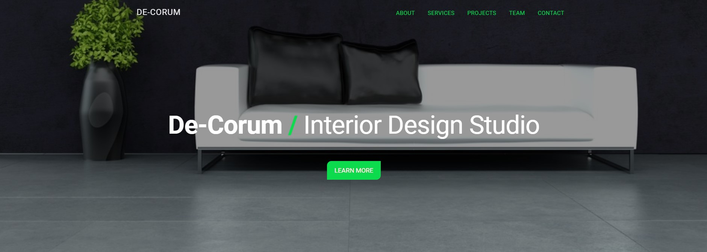
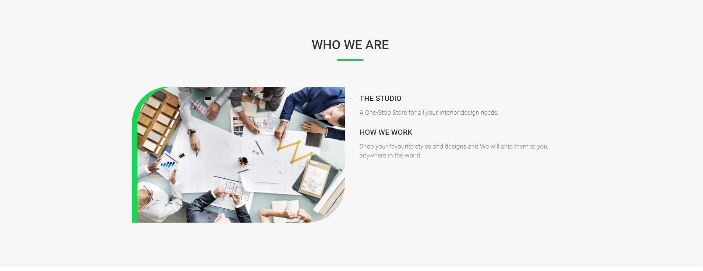
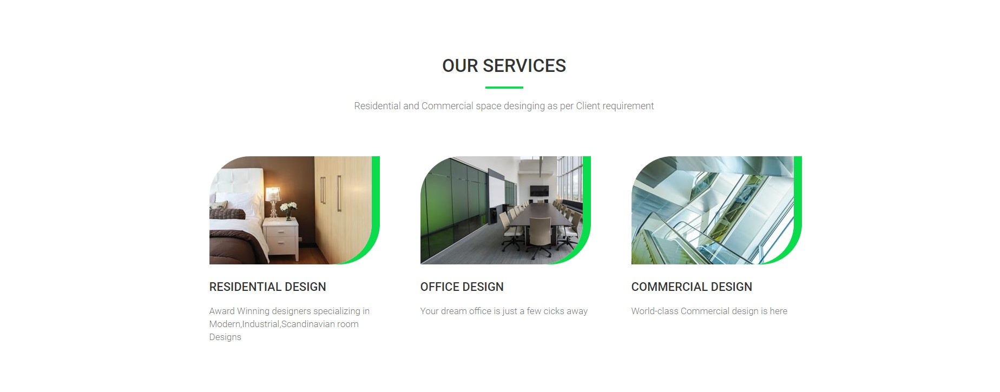
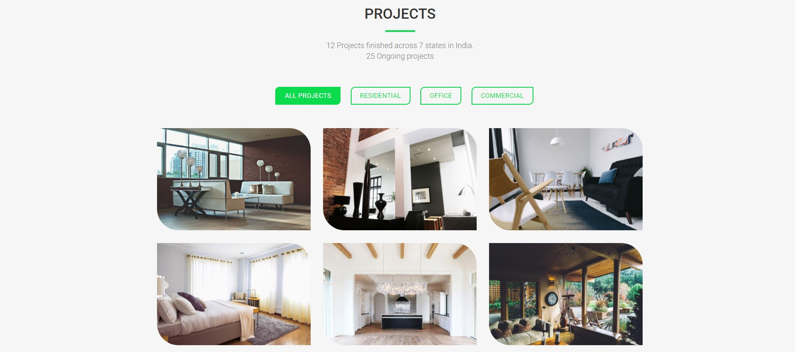
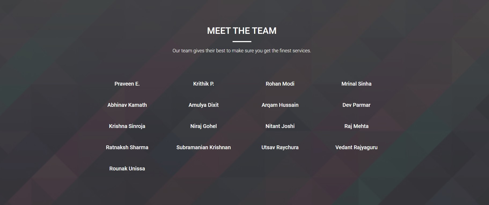
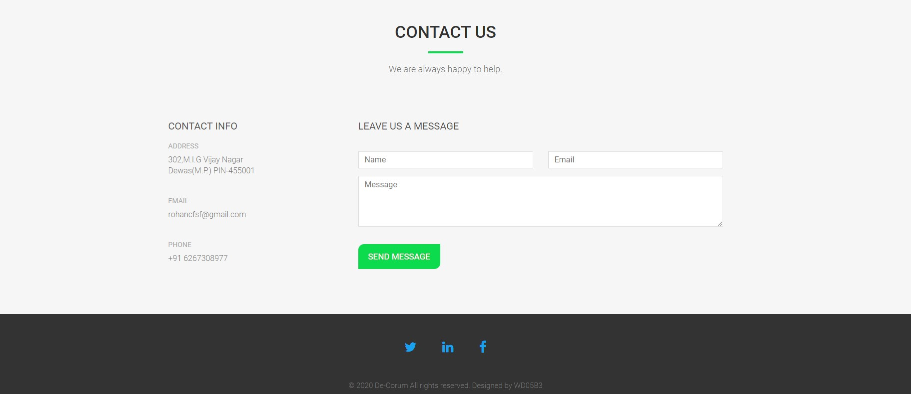

# [Decorum](https://de-corum.herokuapp.com/) ⭐

&nbsp;
&nbsp;
&nbsp;
&nbsp;<br/>
&nbsp;
&nbsp;
&nbsp;


[](https://de-corum.herokuapp.com/)
[](https://github.com/ROHAN842/DecorumInteriorDesign.github.io)

## Overview 👀







- Have a look at some of the finest Interior 🏠 Designs across various parts of country 
- Clean UI ⚡
- Categorization of various Interior Design Projects on the basis of Residential 🏘️, Office 🏢 and Commercial 🏭 space desinging as per the Client 🕵️‍♂️ requirement

## What is Decorum? 🤔

#### Decorum is basically a website developed for such organizations who designs interior for Residence, Office and Commercial purposes as per the clients requirements. 
#### De-corum also consists of various projects which the organization has completed till now in different cities of India.
#### The front end is made with HTML5, CSS3, Bootstrap4 and Javascript, while the back end is made with Nodejs and Expressjs.


## How it works? 🤔
- **Open the website [https://de-corum.herokuapp.com/](https://de-corum.herokuapp.com/)**
- **User can easily see various Interior Design projects, which orgaization has completed till now alongwith categorization between Interior Designs of Residence, Office and Commercial puropses.**
- **By seeing the designs, user can easily communicate 📧 with the organization through Contact 📝 form present at footer of the website.**

## Dependencies 🗃

- [Bootstrap](https://getbootstrap.com/) - **Frontend CSS3 Framework**
- [Node.js](https://nodejs.org/en/) - **Backend Framework**
- [Express.js](https://expressjs.com/) - **Server Side Node.js Framework**

## Run Locally 💻

```
> Clone the repo
    >> For Windows: Git Bash
    >> For Linux: Terminal
    >> git clone https://github.com/ROHAN842/peercoder.git
    >> cd MainFolder/DirectoryName
> Install all dependencies
    >> npm i
> Spin the server on port 3000
    >> cd MainFolder/DirectoryName
    >> nodemon or node index.js
> Visit the website on http://localhost:3000/
    
```
